# flink-processing

```bash
git clone https://github.com/confluentinc/learn-apache-flink-101-exercises.git
cd learn-apache-flink-101-exercises
docker-compose up -d --build
docker-compose run sql-client
```
```sql
CREATE TABLE `bounded_pageviews` (
  `url` STRING,
  `user_id` STRING,
  `browser` STRING,
  `ts` TIMESTAMP(3)
)
WITH (
  'connector' = 'faker',
  'number-of-rows' = '500',
  'rows-per-second' = '100',
  'fields.url.expression' = '/#{GreekPhilosopher.name}.html',
  'fields.user_id.expression' = '#{numerify ''user_##''}',
  'fields.browser.expression' = '#{Options.option ''chrome'', ''firefox'', ''safari'')}',
  'fields.ts.expression' =  '#{date.past ''5'',''1'',''SECONDS''}'
);
```
```sql
select * from bounded_pageviews limit 10;
```
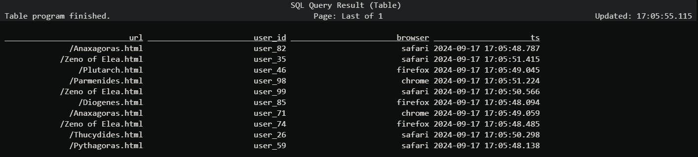

```sql
set 'execution.runtime-mode' = 'batch';
select count(*) AS `count` from bounded_pageviews;
```
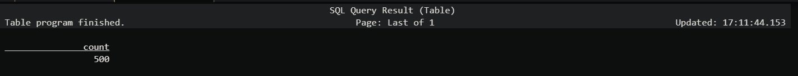

```sql
set 'execution.runtime-mode' = 'streaming';
select count(*) AS `count` from bounded_pageviews;
```

```sql
set 'sql-client.execution.result-mode' = 'changelog';
select count(*) AS `count` from bounded_pageviews;
```
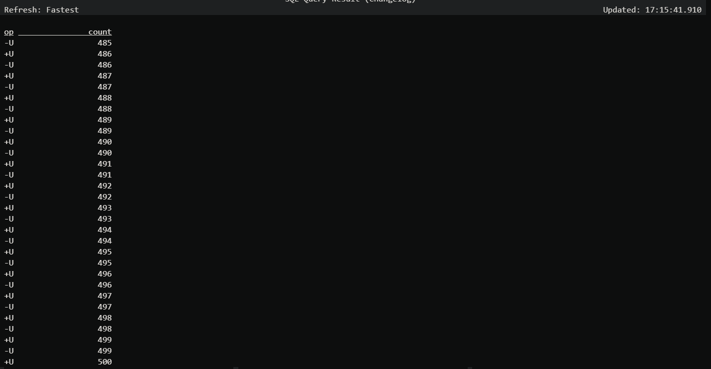

```sql
CREATE TABLE `pageviews` (
  `url` STRING,
  `user_id` STRING,
  `browser` STRING,
  `ts` TIMESTAMP(3)
)
WITH (
  'connector' = 'faker',
  'rows-per-second' = '100',
  'fields.url.expression' = '/#{GreekPhilosopher.name}.html',
  'fields.user_id.expression' = '#{numerify ''user_##''}',
  'fields.browser.expression' = '#{Options.option ''chrome'', ''firefox'', ''safari'')}',
  'fields.ts.expression' =  '#{date.past ''5'',''1'',''SECONDS''}'
);
set 'sql-client.execution.result-mode' = 'table';
select count(*) AS `count` from pageviews;
```
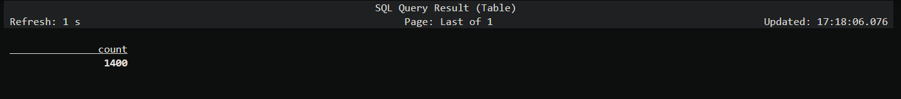

# Viewing the page at http://localhost:8081

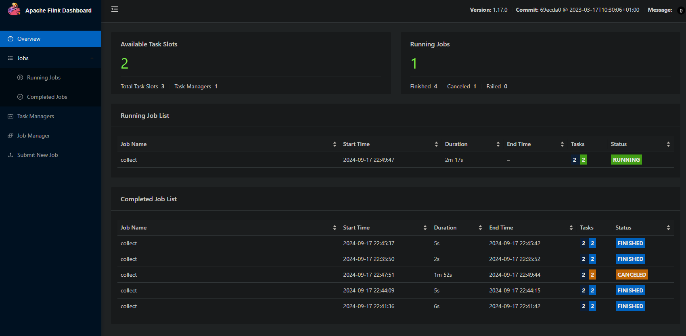
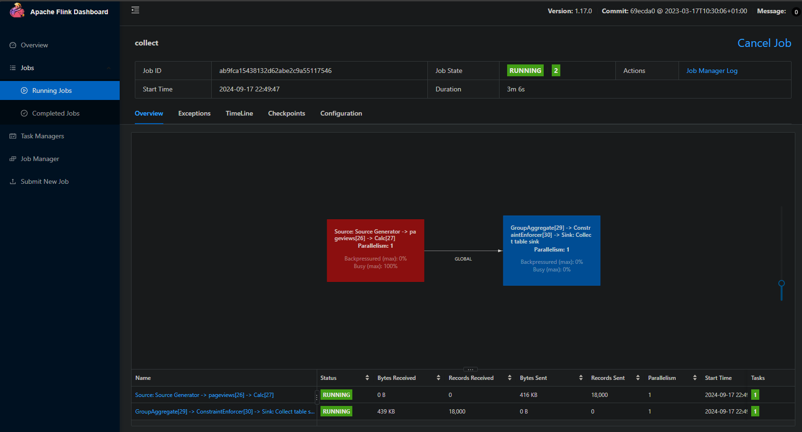

```sql
EXPLAIN select count(*) from pageviews;
```
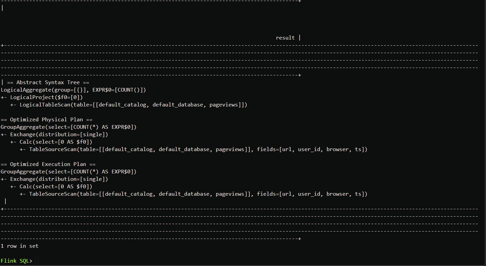

# Create a cluster and topic with name pageviews in confluent cloud and create an API key
# Note the values for api key, api secret and bootstrap_server

```sql
CREATE TABLE pageviews_kafka (
  `url` STRING,
  `user_id` STRING,
  `browser` STRING,
  `ts` TIMESTAMP(3)
) WITH (
  'connector' = 'kafka',
  'topic' = 'pageviews',
  'properties.group.id' = 'demoGroup',
  'scan.startup.mode' = 'earliest-offset',
  'properties.bootstrap.servers' = 'BOOTSTRAP_SERVER',
  'properties.security.protocol' = 'SASL_SSL',
  'properties.sasl.mechanism' = 'PLAIN',
  'properties.sasl.jaas.config' = 'org.apache.kafka.common.security.plain.PlainLoginModule required username="API_KEY" password="API_SECRET";',
  'value.format' = 'json',
  'sink.partitioner' = 'fixed'
);
```

```sql
CREATE TABLE `pageviews` (
  `url` STRING,
  `user_id` STRING,
  `browser` STRING,
  `ts` TIMESTAMP(3)
)
WITH (
  'connector' = 'faker',
  'rows-per-second' = '10',
  'fields.url.expression' = '/#{GreekPhilosopher.name}.html',
  'fields.user_id.expression' = '#{numerify ''user_##''}',
  'fields.browser.expression' = '#{Options.option ''chrome'', ''firefox'', ''safari'')}',
  'fields.ts.expression' =  '#{date.past ''5'',''1'',''SECONDS''}'
);
```

```sql
INSERT INTO pageviews_kafka SELECT * FROM pageviews;
```

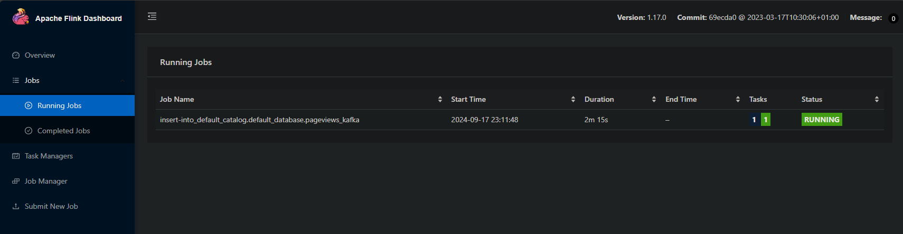

```sql
SELECT * FROM pageviews_kafka;
```

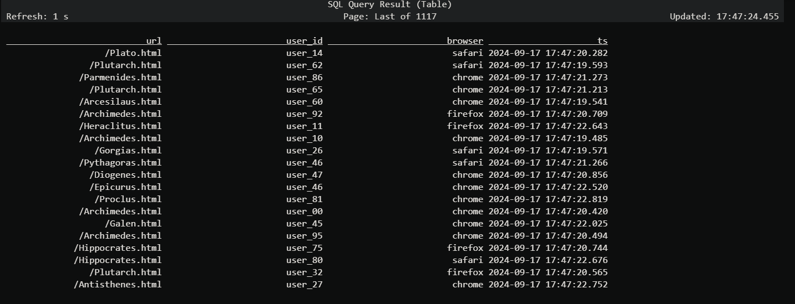
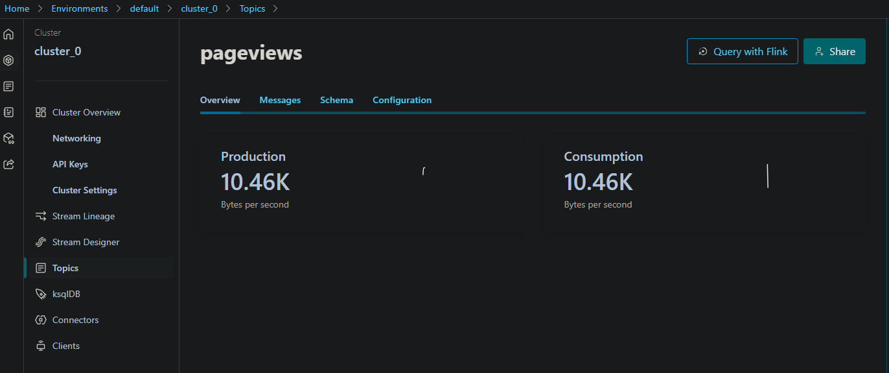

```sql
SELECT browser, COUNT(*) FROM pageviews_kafka GROUP BY browser;
```


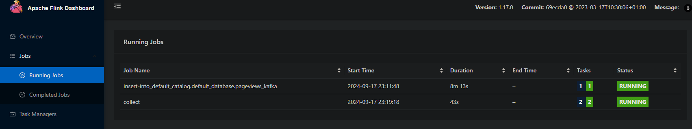
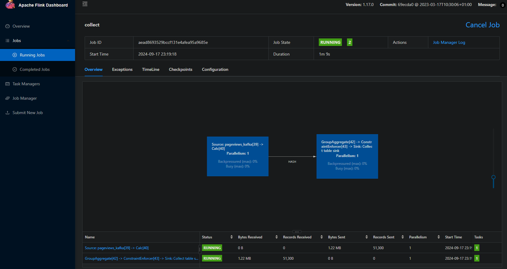

